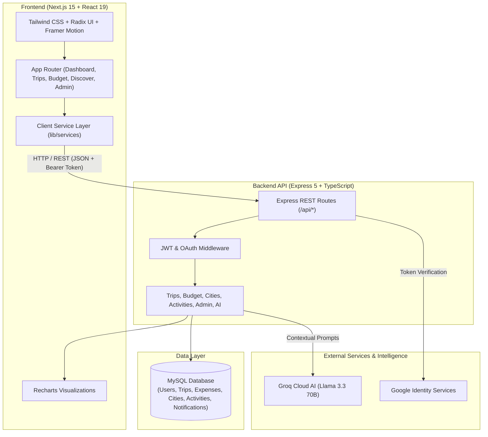

<div align="center">

# 🌍 GlobeTrotter

### *Next-Gen AI-Powered Collaborative Travel Itinerary & Expense Management Platform*

[](https://nextjs.org/)
[](https://react.dev/)
[](https://www.typescriptlang.org/)
[](https://tailwindcss.com/)
[](https://expressjs.com/)
[](https://www.mysql.com/)
[](https://groq.com/)
[](LICENSE)

<p align="center">
  <a href="#-project-overview">Overview</a> •
  <a href="#-problem-statement">Problem</a> •
  <a href="#-solution-overview">Solution</a> •
  <a href="#-key-features">Key Features</a> •
  <a href="#-tech-stack">Tech Stack</a> •
  <a href="#-system-architecture">Architecture</a> •
  <a href="#-getting-started">Installation</a> •
  <a href="#-demo-preview--screenshots">UI Preview</a> •
  <a href="#-team--roles">Team</a>
</p>

---

</div>

## 📖 Project Overview

**GlobeTrotter** is a modern, full-stack, AI-augmented travel planning and collaborative itinerary platform engineered by **Team Code_crew**. Designed for both solo adventurers and group travelers, GlobeTrotter bridges the gap between trip inspiration, meticulous day-by-day scheduling, intelligent budget management, and real-time companion collaboration.

Powered by **Next.js 15**, **Express 5**, **MySQL**, and a context-aware **Groq Llama 3.3 LLM Copilot**, GlobeTrotter eliminates fragmented planning tools by unifying multi-city itineraries, interactive mapping, expense burn analytics, and personalized recommendations into a single, intuitive workspace.

---

## ⚡ Problem Statement

Planning trips today is notoriously fragmented, overwhelming, and inefficient:

1. **Tool Sprawl & Chaos**: Travelers juggle 5–8 separate applications—Google Sheets for budgeting, Notes for itineraries, Google Maps for pins, email threads for confirmations, and chat apps for group coordination.
2. **Budget Blindspots**: Without real-time tracking and visual expense categorization, travelers routinely exceed budgets and face awkward cost-splitting friction with companions.
3. **Generic & Out-of-Context AI**: Most AI travel assistants lack context—they don't know the traveler’s actual scheduled stops, remaining budget, travel pace, or dietary preferences.
4. **Collaboration Friction**: Planning group travel results in conflicting schedules, duplicate bookings, and disconnected communication.

---

## 💡 Solution Overview

**GlobeTrotter** provides an all-in-one ecosystem that transforms chaotic travel planning into an effortless, delightful journey:

```
┌──────────────────────────────────────────────────────────────────────────┐
│                             GLOBETROTTER                                 │
├─────────────────┬──────────────────┬──────────────────┬──────────────────┤
│   🗺️ BUILD      │    🤖 ASSIST     │    💰 TRACK      │    👥 COLLAB     │
│ Multi-City      │ Context-Aware    │ Category Budgets │ Companion Roles  │
│ Timelines, Maps │ Groq AI Copilot  │ & Burn Analytics │ & Share Links    │
└─────────────────┴──────────────────┴──────────────────┴──────────────────┘
```

- **Unified Canvas**: Seamlessly build multi-city, day-by-day timelines with interactive map pins and local weather widgets.
- **Context-Aware AI Copilot**: An intelligent AI assistant with live access to user preferences, planned stops, and budget constraints to deliver actionable packing tips, route optimization, and localized recommendations.
- **Visual Financial Control**: Category-wise budgeting with real-time Recharts visualizations, burn-rate metrics, over-budget warnings, and a live multi-currency converter.
- **Collaborative Hub**: Share read-only public trip links, invite travel companions with role-based access, and export clean travel dossiers to PDF.

---

## ✨ Key Features

### 🗺️ 1. Dynamic Multi-City Itinerary Builder
- **Multi-Stop Structuring**: Organize complex voyages across multiple cities with arrival/departure dates, transport notes, and lodging info.
- **Day-by-Day Activity Timelines**: Schedule activities by specific time slots (Morning, Afternoon, Evening) with category tags (Culture, Food, Nature, Nightlife).
- **Interactive Route Map & Forecasts**: Visual route previews and embedded destination weather forecasts to plan weather-appropriate activities.
- **Trip Duplication & Custom Sharing**: Clone existing itineraries in one click, or generate secure public share links (`/shared/[id]`).
- **PDF Dossier Export**: Generate clean, printable travel summaries for offline navigation.

### 🤖 2. Context-Aware AI Travel Copilot
- **Live Context Injection**: Unlike generic bots, the AI assistant automatically reads the user's active trip itinerary, budget boundaries, travel pace, and saved destinations.
- **Ultra-Fast LLM Inference**: Powered by Groq's high-speed inference engine (`llama-3.3-70b-versatile`).
- **Smart Quick Prompts**: One-click actions for custom packing checklists, local foodie trails, route optimization, and cost comparisons.

### 💰 3. Visual Budget & Expense Tracker
- **Visual Analytics with Recharts**:
  - **Category Pie Chart**: Breakdown across Stays, Flights, Transit, Food, Activities, Shopping, and Misc.
  - **Daily Spending Bar Chart**: Track daily expense burn vs. daily budget limits.
  - **Trend Analysis**: Monitor overall budget consumption progress.
- **Instant Expense Logging**: Log expenses with payment method, category, date, companion attribution, and receipt attachment.
- **Over-Budget Warnings**: Visual warning badges when expenditures exceed allocated thresholds.
- **Multi-Currency Converter**: Built-in interactive currency conversion modal for real-time exchange estimations.

### 🧭 4. Destination & Activity Discovery Hub
- **Curated City Guides**: Explore top destinations worldwide with cost indices, popularity metrics, climate overviews, and high-resolution galleries.
- **Activity Marketplace**: Filter activities by city, category, duration, cost, and user ratings with booking indicators.

### 📅 5. Visual Travel Calendar
- Comprehensive calendar view displaying multi-trip date ranges and scheduled daily events to prevent overlapping bookings.

### 👥 6. Companion Collaboration & Sharing
- **Role-Based Access**: Invite travel companions as `Editor` or `Viewer`.
- **Public Share Links**: Shareable responsive itinerary preview for family and friends.

### 🛡️ 7. Security & User Preferences
- **Dual Authentication**: Secure password-based authentication with bcrypt (12 rounds) & JWT tokens, plus Google OAuth 2.0 integration.
- **Personalized Traveler Profile**: Customize preferred currency, distance units (km/miles), travel pace (relaxed/moderate/fast), interface themes, and earn travel badges.

### 📊 8. Admin & Platform Analytics
- Comprehensive platform dashboard monitoring total registered users, active trips, cumulative planned spend, monthly user/trip growth curves, and trending destinations.

---

## 🛠️ Tech Stack

### Frontend
| Technology | Purpose |
|---|---|
| **Next.js 15** | React Framework with App Router architecture & optimized bundling |
| **React 19** | Modern UI component rendering with hooks and concurrency |
| **TypeScript 5** | End-to-end type safety and maintainable codebase |
| **Tailwind CSS 3** | Utility-first styling with custom design tokens |
| **Radix UI** | Accessible, headless UI primitives (Dialogs, Dropdowns, Sheets, Tabs) |
| **Framer Motion** | Smooth UI transitions, staggered animations, and 3D globe effects |
| **Recharts** | Interactive SVG financial charts and analytics visualizations |
| **React Hook Form + Zod** | Declarative form handling with schema-based client validation |
| **Lucide Icons** | Clean, consistent iconography |
| **Sonner** | Modern, customizable toast notification system |

### Backend & AI
| Technology | Purpose |
|---|---|
| **Node.js & Express 5** | RESTful API server with modular route handlers |
| **MySQL & mysql2** | Relational data persistence with connection pooling and JSON support |
| **Groq Cloud API** | Ultra-low latency LLM inference running Llama 3.3 70B Versatile |
| **JWT & bcryptjs** | Stateless token authentication and cryptographically secure password hashing |
| **Google Auth Library** | Secure Google OAuth 2.0 verification and social login |
| **TSX** | TypeScript execution and live hot-reloading in development |

---

## 🏗️ System Architecture



---

## 📂 Project Structure

```text
Code_crew/
├── README.md                   # Project documentation & evaluator guide
├── backend/                    # Express 5 + TypeScript REST API
│   ├── src/
│   │   ├── db/
│   │   │   ├── init.ts         # Schema creation & initial dataset seed script
│   │   │   └── pool.ts         # MySQL connection pool configuration
│   │   └── server.ts           # Express application, routes, AI copilot & auth
│   ├── .env                    # Environment variables configuration
│   ├── package.json            # Backend dependencies and scripts
│   └── tsconfig.json           # Backend TypeScript configuration
└── frontend/                   # Next.js 15 App Router Frontend
    ├── app/
    │   ├── (auth)/             # Auth routes (login, signup)
    │   ├── (main)/             # Authenticated workspace layout
    │   │   ├── admin/          # Admin performance & metrics dashboard
    │   │   ├── budget/         # Budget overview & expense management
    │   │   ├── calendar/       # Travel calendar & scheduled itineraries
    │   │   ├── dashboard/      # User dashboard & upcoming adventures
    │   │   ├── discover/       # Destination & activity discovery marketplace
    │   │   ├── profile/        # Traveler profile, settings, & badges
    │   │   └── trips/          # Trip creation wizard, detail view, & timeline builder
    │   ├── shared/[id]/        # Public responsive shareable itinerary page
    │   ├── globals.css         # Tailwind directives & design system tokens
    │   ├── layout.tsx          # Root application layout
    │   ├── page.tsx            # High-conversion landing page with 3D Globe
    │   └── providers.tsx       # Theme, tooltip, and toast providers
    ├── components/
    │   ├── charts/             # BudgetPieChart, SpendingBarChart, TripTrendsAreaChart
    │   ├── common/             # AITravelAssistant, CurrencyConverter, ExportPdfModal
    │   ├── forms/              # LoginForm, SignupForm, CreateTripForm, AddExpenseModal
    │   ├── layout/             # AppNavbar, AppSidebar, LandingNavbar, Footer
    │   ├── map/                # AnimatedGlobeHero, InteractiveTripMap
    │   ├── trip/               # TripCard, ActivityCard, DestinationCard, WeatherCard
    │   └── ui/                 # Accessible Radix UI components
    ├── data/                   # Mock fallback seeds & static definitions
    ├── lib/
    │   ├── api.ts              # Universal client fetch wrapper with auth injection
    │   ├── services/           # Domain services (trip, city, budget, activity, user)
    │   └── utils.ts            # Class merge utilities (clsx + tailwind-merge)
    ├── types/                  # Domain TypeScript interfaces (trip, budget, city, user)
    ├── next.config.ts          # Next.js build configuration
    ├── package.json            # Frontend dependencies and scripts
    ├── tailwind.config.ts      # Tailwind CSS theme configuration
    └── tsconfig.json           # Frontend TypeScript configuration
```

---

## 🚀 Getting Started

Follow these steps to run the complete GlobeTrotter platform locally.

### Prerequisites
- **Node.js**: `v18.18.0` or higher (Recommended: `v20.x`)
- **MySQL Server**: `v8.0+` running locally or via Docker
- **Package Manager**: `npm`, `pnpm`, or `yarn`

---

### Step 1: Clone the Repository
```bash
git clone -b development https://github.com/hitanshigor1572/Code_crew.git
cd Code_crew
```

---

### Step 2: Configure & Start the Backend

1. Navigate to the `backend` folder:
   ```bash
   cd backend
   ```

2. Install backend dependencies:
   ```bash
   npm install
   ```

3. Configure your `.env` file inside `backend/.env`:
   ```env
   PORT=4000
   FRONTEND_URL=http://localhost:3000
   JWT_SECRET=your-super-secret-jwt-key
   DB_HOST=localhost
   DB_PORT=3306
   DB_USER=root
   DB_PASSWORD=your_mysql_password
   DB_NAME=globetrotter

   # AI Copilot (Groq Cloud)
   GROQ_API_KEY=your_groq_api_key
   GROQ_MODEL=llama-3.3-70b-versatile

   # Optional Google OAuth
   # GOOGLE_CLIENT_ID=your_google_client_id
   # GOOGLE_CLIENT_SECRET=your_google_client_secret
   # GOOGLE_REDIRECT_URI=http://localhost:4000/api/auth/google/callback
   ```

4. Initialize and seed the MySQL database:
   ```bash
   npm run db:init
   ```
   > *This creates all tables and populates curated demo cities, activities, and a sample user account.*

5. Start the backend API server:
   ```bash
   npm run dev
   ```
   The backend API will be live at **`http://localhost:4000`**.

---

### Step 3: Configure & Start the Frontend

1. Open a new terminal window and navigate to the `frontend` folder:
   ```bash
   cd frontend
   ```

2. Install frontend dependencies:
   ```bash
   npm install
   ```

3. Start the Next.js development server:
   ```bash
   npm run dev
   ```

4. Open your browser and navigate to:
   ```
   http://localhost:3000
   ```

---

## � Demo Account Credentials

For quick evaluation without manual signup, use the seeded demo account:

| Field | Value |
|---|---|
| **Email** | `alex.morgan@globetrotter.io` |
| **Password** | `password123` |
| **Role** | Demo Traveler / Explorer |

> *You can also create a brand new account using the Sign Up form or configure Google OAuth for one-click login.*

---

##  API Reference Summary

| Method | Endpoint | Description | Auth Required |
|---|---|---|:---:|
| `POST` | `/api/auth/signup` | Register a new user | No |
| `POST` | `/api/auth/login` | Authenticate user & receive JWT | No |
| `GET` | `/api/auth/google` | Initiate Google OAuth 2.0 flow | No |
| `GET` | `/api/users/me` | Fetch active user profile & preferences | Yes |
| `PATCH` | `/api/users/me` | Update travel pace, currency, bio, etc. | Yes |
| `GET` | `/api/trips` | Retrieve user's trips (filterable by status) | Yes |
| `POST` | `/api/trips` | Create a new trip with multi-city metadata | Yes |
| `GET` | `/api/trips/:id` | Get detailed trip itinerary by ID or share ID | Optional |
| `PATCH` | `/api/trips/:id` | Update itinerary stops, dates, and budget | Yes |
| `DELETE` | `/api/trips/:id` | Remove a trip | Yes |
| `GET` | `/api/budget` | Get budget analytics, categories & daily spend | Yes |
| `POST` | `/api/budget/expenses` | Add a new categorized expense | Yes |
| `POST` | `/api/ai/chat` | Send message to context-aware Groq AI Copilot | Yes |
| `GET` | `/api/cities` | Search curated global cities & metadata | No |
| `GET` | `/api/activities` | Query activities with filters (category, city) | No |
| `GET` | `/api/admin/metrics` | Platform analytics & user growth metrics | Admin |

---

## 📸 Demo Preview & Interface Showcase

| View | Description | Preview |
|---|---|:---:|
| **Landing & Hero** | 3D interactive globe, dynamic stats, testimonials & feature showcases | `[ Hero & Globe Preview ]` |
| **Dashboard** | Overview of upcoming trips, quick actions, expense summaries & AI prompts | `[ Dashboard Preview ]` |
| **Itinerary Builder** | Day-by-day timeline, interactive map pins, activity scheduling & weather | `[ Itinerary Builder Preview ]` |
| **Budget Analytics** | Recharts category allocation, daily burn rates, and expense logging modal | `[ Budget Analytics Preview ]` |
| **AI Travel Copilot** | Context-aware slide-out chat assistant powered by Groq Llama 3.3 | `[ AI Assistant Preview ]` |
| **Admin Portal** | Platform analytics, user growth curves, and trip management | `[ Admin Dashboard Preview ]` |

---

## 🔮 Future Improvements & Roadmap

- [ ] **Real-Time Concurrent Collaboration**: WebSocket/Supabase Realtime integration for live multiplayer cursor editing and instant chat.
- [ ] **External Live Booking Integrations**: Direct price-checking and booking links via Amadeus / Skyscanner and Booking.com APIs.
- [ ] **Smart OCR Receipt Scanner**: Upload receipt photos to auto-populate expense title, amount, currency, and category using Vision AI.
- [ ] **Offline Progressive Web App (PWA)**: Full offline service worker caching with GPS-enabled walking directions for on-the-go travelers.
- [ ] **Community Itinerary Marketplace**: Allow verified creators to publish, monetize, and share custom travel itineraries.

---

## 👥 Team & Roles

Crafted with passion for the Hackathon by **Team Code_crew**:

| Member | Primary Focus & Contributions | GitHub Profile |
|---|---|:---:|
| **Hitanshi Gor** | Frontend Architecture, Design System & UI/UX Component Library | [@hitanshigor1572](https://github.com/hitanshigor1572) |
| **Jay Prajapati** | Backend Architecture, Express REST API, Auth & Groq AI Copilot | [@jayprajapati19](https://github.com/jayprajapati19) |
| **Shivani Siddhpura** | Database Architecture, Schema Migrations, Seeding & Documentation | [@shivanisiddhpura244](https://github.com/shivanisiddhpura244) |
| **Chaitany Bumtariya** | Client Services Layer, State Flow, Profile & Preference Management | [@Chaitany106](https://github.com/Chaitany106) |

---

## 📄 License

This project is open-source and licensed under the [MIT License](LICENSE).

---

<div align="center">
     <sub>Built with ❤️ by <b>Code_crew</b> for the Hackathon. If you find GlobeTrotter inspiring, give it a ⭐ on GitHub!</sub>
</div>
  <sub>Built with ❤️ by <b>Code_crew</b> for the Hackathon. If you find GlobeTrotter inspiring, give it a ⭐ on GitHub!</sub>
</div>
